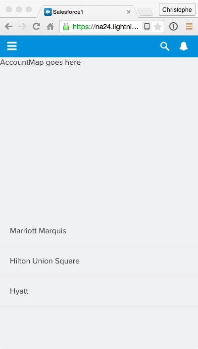

In this module, you create the AccountList component responsible for displaying the list of accounts. You also create the AccountListItem component that you nest inside AccountList to render individual accounts in the list.

## What you will learn
- Nest Lightning Components
- Use component attributes
- Use the Lightning iterator

## Step 1: Create the AccountListItem Component

1. In the Developer Console, click **File** > **New** > **Lightning Component**. Specify **AccountListItem** as the bundle name and click **Submit**.

1. Implement the component as follows:

    ```
    <aura:component>

        <aura:attribute name="account" type="Account"/>

        <li><a>{!v.account.Name}</a></li>

    </aura:component>
    ```

    ### Code Highlights:
    - The ```account``` attribute is defined to hold the account the list item is responsible for displaying. The value of the account attribute will be provided by the AccountList component you create in step 2.
    - The component UI consists of a simple HTML ```<li>``` element.
    - ```{!v.account.Name}``` is the Lightning data binding notation to render the account name inside the ```<li>``` tag.
    - The ```<a>``` tag that wraps the account name makes the account selectable. You'll hook that up in part 8.

1. Click **File** > **Save** to save the component.

1. Click **STYLE** (upper right corner) and implement the component styles as follows:

    ```
    .THIS {
        border-bottom: solid 1px #DDDDDD;
    }

    .THIS a {
        display: block;
        padding: 20px;
        color: inherit;
    }

    .THIS a:active {
        background-color: #E8F4FB;
    }
    ```

    ### Code Highlights:
    - ```.THIS``` refers to the root level ```<li>``` tag.
    - ```.THIS a``` refers to the anchor tags within the component.
    - The ```:active``` CSS pseudo-class sets a different background when the list item is selected in order to highlight the selection.

1. Click **File** > **Save** to save the styles.


## Step 2: Create the AccountList Component

1. In the Developer Console, click **File** > **New** > **Lightning Component**. Specify **AccountList** as the bundle name and click **Submit**.

2. Implement the component as follows:

    ```
    <aura:component controller="AccountController">

        <aura:attribute name="accounts" type="Account[]"/>
        <aura:handler name="init" value="{!this}" action="{!c.doInit}" />

        <ul>
            <aura:iteration items="{!v.accounts}" var="account">
                <c:AccountListItem account="{!account}"/>
            </aura:iteration>
        </ul>

    </aura:component>
    ```

    ### Code Highlights:
    - The controller assigned to the component (first line of code) refers to the **server-side controller** (AccountController) you created in part 3.
    - The ```accounts``` attribute is defined to hold the list of Account objects returned by the server.
    - The ```init``` handler is defined to execute some code when the component is initialized. ```doInit``` is defined in the component's **client-side controller** (you'll implement the controller in the following steps).
    - ```<aura:iteration>``` is used to iterate through the list of accounts and create an instance of  ```AccountListItem``` for each account.

1. Click **File** > **Save** to save the component.

1. Click **CONTROLLER**, and implement the Controller as follows:

    ```
    ({
        doInit : function(component, event) {
            var action = component.get("c.findAll");
            action.setCallback(this, function(a) {
                component.set("v.accounts", a.getReturnValue());
            });
            $A.enqueueAction(action);
        }
    })
    ```

    ### Code Highlights:
    - The controller has a single function called ```doInit()```. This is the function the component calls when it is initialized.
    - You first get a reference to the ```findAll()``` method in the component's server-side controller (AccountController), and store it in the ```action``` variable.
    - Since the call to the server's findAll() method is asynchronous, you then register a callback function that is executed when the call returns. In the callback function, you simply assign the list of accounts to the component's ```accounts``` attribute.
    - ```$A.enqueueAction(action)``` sends the request the server. More precisely, it adds the call to the queue of asynchronous server calls. That queue is an optimization feature of Lightning.

1. Click **File** > **Save** to save the controller.

1. Click **STYLE** (upper right corner) and implement the component styles as follows:

    ```
    .THIS {
        list-style-type: none;
        padding: 0;
        margin: 0;
        background: #FFFFFF;
        height: 100%;
    }
    ```

    ### Code Highlights:
    - ```.THIS``` refers to the root level ```<ul>``` tag.
    - ```list-style-type: none``` is used to remove the standard item bullets.

1. Click **File** > **Save** to save the styles.

## Step 3: Add AccountList to the AccountLocator Component

1. In the developer console, go back to the **AccountLocator** component.

    If you don't see the tab in the developer console, click **File** > **Open Lightning Resources** in the Developer Console menu, select **AccountLocator** > **COMPONENT** in the dialog, and click the **Open Selected** button.

1. Replace the AccountList placeholder with the actual component:


    ```
    <aura:component implements="force:appHostable">

        <div>
            <div>
                AccountMap goes here
            </div>
            <div>
    		    <c:AccountList />
        	</div>
        </div>

    </aura:component>
    ```

1. Click **File** > **Save** to save the component.

1. Go back to the Salesforce1 app and reload **Account Locator** from the menu to see the changes:

    

<div class="row" style="margin-top:40px;">
<div class="col-sm-12">
<a href="create-accountlocator-component.html" class="btn btn-default"><i class="glyphicon glyphicon-chevron-left"></i> Previous</a>
<a href="create-accountmap-component.html" class="btn btn-default pull-right">Next <i class="glyphicon glyphicon-chevron-right"></i></a>
</div>
</div>
