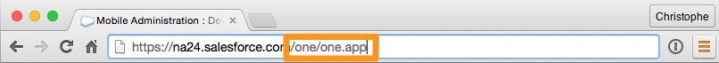

In this module, you create the skeleton for the AccountLocator Lightning Component, and you test it in the Salesforce1 application.

## What you will learn
- Create a Lightning Component
- Style a Lightning Component
- Deploy a Lightning Component in the Salesforce1 application
- Preview your Lightning Component in the Salesforce1 Application or the simulator


## Step 1: Create the AccountLocator Component

1. In the Developer Console, click **File** > **New** > **Lightning Component**. Specify **AccountLocator** as the bundle name and click **Submit**.

2. Implement the component as follows:

    ```
    <aura:component implements="force:appHostable">

        <div>
            <div>AccountMap goes here</div>
            <div>AccountList goes here</div>
        </div>

    </aura:component>
    ```

    ### Code Highlights:
    - The component implements the ```force:appHostable``` interface to indicate that it can run in the Salesforce1 application.
    - Lightning components can include regular HTML markup and other Lightning components.


1. Click **STYLE** (upper right corner), and implement the component style as follows:

    ```
    .THIS {
        position:absolute;
        height: 100%;
        width: 100%;
    }

    .THIS>div {
        height: 50%;
    }
    ```

    ### Code Highlights:
    - ```.THIS``` refers to the root level div tag.
    - ```.THIS>div``` refers to the divs that are immediate children of the root div. There are two of them in this component, and we split the component height evenly between them.

1. Click **File** > **Save** to save the file.


## Step 2: Create a Tab for the AccountLocator Component

1. In Setup, click **Create** > **Tabs**.

1. In the **Lightning Component Tabs** section, click **New**.

    
    - Select **c:AccountLocator** as the Lightning Component.
    - Specify **Account Locator** as the Tab Label and **Account_Locator** as the Tab Name.
    - Click the magnifier icon and select **Map** as the tab icon.

1. Click **Next** and **Save**.


## Step 3: Add the Tab to Mobile Navigation

1. In Setup, Select **Administer** > **Mobile Administration** > **Mobile Navigation**:

    
    - Select **Account Locator** in the **Available** list.
    - Click **Add**.
    - Select  **Account Locator** in the **Selected** List, and click the **Up** button to move the tab up in the menu order.
    - Click **Save**.


## Step 4: Preview the Component in the Salesforce1 Application

1. In Salesforce, modify the URL as follows:

    
    - Remove the part of the URL that comes immediately after salesforce.com
    - Append **/one/one.app** to the URL immediately after salesforce.com

    > This starts the Salesforce1 Application simulator.

1. Click the menu button in the upper left corner.

1. Select **Account Locator** in the menu.

    

1. Preview the component.

    

<div class="row" style="margin-top:40px;">
<div class="col-sm-12">
<a href="create-apex-controller.html" class="btn btn-default"><i class="glyphicon glyphicon-chevron-left"></i> Previous</a>
<a href="create-accountlist-component.html" class="btn btn-default pull-right">Next <i class="glyphicon glyphicon-chevron-right"></i></a>
</div>
</div>
