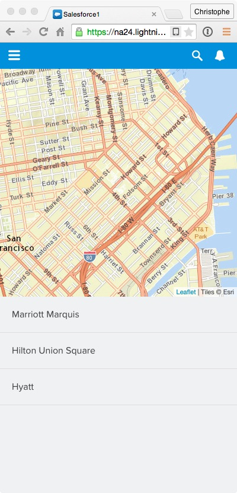

In this module, you create the AccountMap component responsible for displaying the accounts on a map.

## What you will learn
- Use third party libraries in Lightning components
- Use the ltng:require tag to load external style sheets and external JavaScript libraries

## Step 1: Import Leaflet as a Static Resource

> [Leaflet](http://leafletjs.com/) is a popular open-source JavaScript library for mobile-friendly interactive maps.

1.  Download the latest stable version of leaflet [here](http://leafletjs.com/download.html) (0.7.3 at the time of this writing).

2. In **Setup**, go to **Build** > **Develop** > **Static Resources**, and click **New**.

3. Specify **leaflet** (all lowercase) as the Name, click the **Choose File** button and select the leaflet zip file you just downloaded.

4. Click **Save**.

## Step 2: Create the AccountMap Component

1. In the Developer Console, click **File** > **New** > **Lightning Component**. Specify **AccountMap** as the bundle name and click **Submit**.

    Implement the Component as follows:

    ```
    <aura:component>

        <aura:attribute name="map" type="Object"/>

        <ltng:require styles="/resource/leaflet/leaflet.css" />
        <ltng:require scripts="/resource/leaflet/leaflet.js"
                 afterScriptsLoaded="{!c.jsLoaded}" />

        <div id="map"></div>

    </aura:component>
    ```

    ### Code Highlights
    - The ```map``` attribute is defined to hold a reference to Leaflet map object. You create that object in the component's controller below.
    - ```ltng:require styles=""``` allows you to load external stylesheets available in static resources.
    - ```ltng:require scripts=""``` allows you to load external JavaScript files available in static resources.
    - ```afterScriptsLoaded``` allows you to register an event handler that will automatically be called when the external style sheet or JavaScript file is loaded.
    - The ```map``` div is the container where Leaflet will load the map tiles.


1. Click **File** > **Save** to save the component.

1. Click **CONTROLLER** (upper right corner of the code editor), and implement the controller as follows:

    ```
    ({
        jsLoaded: function(component, event, helper) {

            setTimeout(function() {
                var map = L.map('map', {zoomControl: false})
                            .setView([37.784173, -122.401557], 14);
                L.tileLayer('https://server.arcgisonline.com/ArcGIS/rest/services/World_Street_Map/MapServer/tile/{z}/{y}/{x}',
                    {
                        attribution: 'Tiles © Esri'
                    }).addTo(map);
                component.set("v.map", map);
            });
        }
    })
    ```

    ### Code Highlights
    - This is standard Leaflet code to create a map.
    - ```component.set("v.map", map);``` is used to store the Leaflet map object in a component attribute so that it can later be accessed by other controller functions.

1. Click **File** > **Save** to save the controller.

1. Click **STYLE** (upper right corner of the code editor), and implement the following style:

    ```
    .THIS {
        width: 100%;
        height: 100%;
    }
    ```

    ### Code Highlights
    - ```.THIS``` refers to the component's root level (and only) div element.

1. Click **File** > **Save** to save the styles.

## Step 3: Add AccountMap to the AccountLocator Component

1. In the developer console, go back to the **AccountLocator** component.

    If you don't see the tab in the developer console, click **File** > **Open Lightning Resources** in the Developer Console menu, select **AccountLocator** > **COMPONENT** in the dialog, and click the **Open Selected** button.

1. Replace the AccountMap placeholder with the actual component:


    ```
    <aura:component implements="force:appHostable">

        <div>
            <div>
                <c:AccountMap />
            </div>

            <div>
                <c:AccountList />
            </div>
        </div>

    </aura:component>
    ```

1. Click **File** > **Save** to save the component.

1. Go back to the Salesforce1 app and reload **Account Locator** from the menu to see the changes:

    


<div class="row" style="margin-top:40px;">
<div class="col-sm-12">
<a href="create-accountlist-component.html" class="btn btn-default"><i class="glyphicon glyphicon-chevron-left"></i> Previous</a>
<a href="using-lightning-events.html" class="btn btn-default pull-right">Next <i class="glyphicon glyphicon-chevron-right"></i></a>
</div>
</div>
