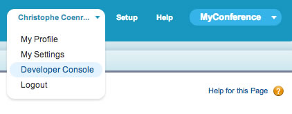

Lightning makes it easy to work with data. In this module, you create an Apex controller that allows your Lightning components to retrieve a list of accounts with their location information.

## What you will learn
- Create an Apex Controller that exposes data and logic to the client application


## Steps

1. In Salesforce, click your name in the upper right corner of the screen. In the dropdown menu, click **Developer Console**.

    

1. In the Developer Console, click **File** > **New** > **Apex Class**. Specify **AccountController** as the class name and click **OK**.

2. Implement the class as follows:

    ```java
    public with sharing class AccountController {

        @AuraEnabled
        public static List<Account> findAll() {
            return [SELECT id, name, Location__Latitude__s, Location__Longitude__s
                    FROM Account
                    WHERE Location__Latitude__s != NULL AND Location__Longitude__s != NULL
                    LIMIT 50];
        }

    }
    ```


    ### Code Highlights:
    - **AccountController** is a regular controller class with a method to retrieve a list of accounts that have location information.
    - You need to annotate your methods with **@AuraEnabled** to make them available to Lightning components.

1. Click **File** > **Save** to save the file.


<div class="row" style="margin-top:40px;">
<div class="col-sm-12">
<a href="enable-geolocation.html" class="btn btn-default"><i class="glyphicon glyphicon-chevron-left"></i> Previous</a>
<a href="create-accountlocator-component.html" class="btn btn-default pull-right">Next <i class="glyphicon glyphicon-chevron-right"></i></a>
</div>
</div>
