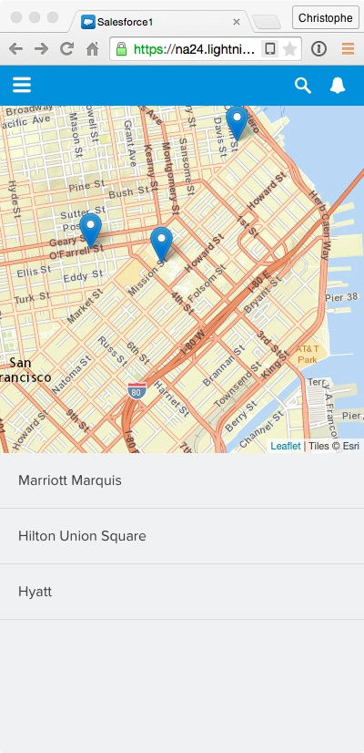

In this module, you create a Lightning event used by AccountList to notify AccountMap that the list of accounts is available. In response to this event, AccountMap adds a marker to the map for each account in the list.

## What you will learn

- Communicate between components using events
- Create custom Lightning Events
- Trigger Lightning events
- Register event listeners and handle Lightning events


## Step 1: Create the AccountsLoaded Event

1. In the Developer Console, click **File** > **New** > **Lightning Event**. Specify **AccountsLoaded** as the bundle name and click **Submit**.

1. Implement the event as follows:

    ```
    <aura:event type="APPLICATION">
        <aura:attribute name="accounts" Type="Account[]"/>
    </aura:event>
    ```
    ### Code Highlights:
    - The event holds one argument: the list of accounts.

1. Click **File** > **Save** to save the file.

## Step 2: Trigger the AccountsLoaded Event

1. In the developer console, go back to the **AccountList** component.

1. Click **CONTROLLER** (upper right corner in the code editor)

1. In ```doInit```, add the logic to fire the AccountsLoaded event in the action callback function:

    ```
    ({
        doInit : function(component, event) {
            var action = component.get("c.findAll");
            action.setCallback(this, function(a) {
                component.set("v.accounts", a.getReturnValue());
                var event = $A.get("e.c:AccountsLoaded");
                event.setParams({"accounts": a.getReturnValue()});
                event.fire();
            });
            $A.enqueueAction(action);
        }
    })
    ```

    ### Code Highlights:
    - You first get an instance of the **AccountsLoaded** event
    - You then set the event's **accounts** parameter to the list of accounts returned by the server
    - Finally, you **fire** the event so that registered listeners can catch it

1. Click **File** > **Save** to save the controller.

## Step 3: Handle the AccountsLoaded Event

1. In the developer console, go back to the **AccountMap** component

1. Add the following event registration declaration immediately after the map attribute declaration:

    ```
    <aura:handler event="c:AccountsLoaded" action="{!c.accountsLoaded}"/>
    ```

1. Click **File** > **Save** to save the component.

1. Click **CONTROLLER** (upper right corner in the code editor), and define a new **accountsLoaded** function positioned right after the jsLoaded function and implemented as follows:

    > Make sure you add a comma after the jsLoaded function block.

    ```
    accountsLoaded: function(component, event, helper) {

	    // Add markers
        var map = component.get('v.map');
        var accounts = event.getParam('accounts');
        for (var i=0; i<accounts.length; i++) {
            var account = accounts[i];
            var latLng = [account.Location__Latitude__s, account.Location__Longitude__s];
            L.marker(latLng, {account: account}).addTo(map);
        }
	}
    ```

1. Click **File** > **Save** to save the controller.

1. Go back to the Salesforce1 app and reload **Account Locator** from the menu to see the changes:

    


<div class="row" style="margin-top:40px;">
<div class="col-sm-12">
<a href="create-accountmap-component.html" class="btn btn-default"><i class="glyphicon glyphicon-chevron-left"></i> Previous</a>
<a href="using-lightning-events2.html class="btn btn-default pull-right">Next <i class="glyphicon glyphicon-chevron-right"></i></a>
</div>
</div>
